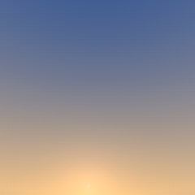
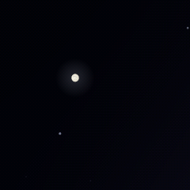

# skyshot · 天空快照

把「此刻头顶的天空」收进一块 **320×240 横屏**：微雪 ESP32-S3-LCD-2.8 + ST7789，
按真实天文算法实时渲染**你所在位置当前**的太阳、月亮和亮星。

| 正午 | 日落 | 夜晚 |
| --- | --- | --- |
|  |  |  |

> 这三张是 PC 端验证工具导出的帧，与实机逐像素一致（同一套渲染代码）。

## 特性

- **真实天文**：太阳位置（低精度历表）、月亮位置（Meeus 简化算法）与月相、83 颗亮星（Vmag < 3.0）
- **等角立体投影**：以视线中心为投影中心，星座怎么摆屏上就怎么摆，不随高度角横向拉伸
- **完整的天空配色**：白天 → 金色时刻 → 民政/航海/天文暮光 → 夜，地平色随太阳方位混合，日落时整体偏红
- **星点闪烁**：每颗星独立的相位/频率/强度（哈希生成，无需存储）
- **月亮细节**：相位几何（凸月/半月/残月）、月海、确定性生成的环形山，圆盘够大时自动开启
- **联网校时后关闭 WiFi**：上电连 WiFi → HTTP API 取时间 → 关射频 → 内部计时自走（可选定时重新校时）
- **省电设计**：画面里没有星星时（白天）完全待机，只在整分钟重建一次背景并推一帧；有星星才按 20 fps 叠星刷新
- **手机网页配置**：方位角拨轮、经纬度度分秒拖动输入、视场角/底边高度/闪烁强度、自动或手动时间、实时预览太阳月亮位置，参数存 NVS 断电保留
- **不依赖外部字体/库**：网页 gzip 压缩后内嵌在固件里（约 11 KB），配置时不需要联网

## 硬件

- 微雪 **ESP32-S3-LCD-2.8**：ESP32-S3 + ST7789 **320×240 横屏**（原生 240×320 旋转 90°），SPI：SCLK=40 MOSI=45 CS=42 DC=41 RST=39 BL=5，BOOT 键 GPIO0
- 引脚与屏幕旋转见 [include/config.h](include/config.h)

横屏**不是**把 240×240 直接拉伸铺满：投影缩放只与屏幕**高度**绑定，320 宽的 80 列按同一
等角立体投影真实渲染更宽的方位角。垂直方向与早期 240×240 版完全同尺度，星点/太阳/月亮
始终是正圆，不压扁。

## 快速开始

1. 安装 [PlatformIO](https://platformio.org/)，打开本工程
2. 填 WiFi：复制模板或直接改 [include/config.h](include/config.h)
   ```c
   // include/config.local.h（本文件已在 .gitignore 中，适合放私人配置）
   #define CFG_WIFI_SSID "你的WiFi名称"
   #define CFG_WIFI_PASS "你的WiFi密码"
   ```
3. 编译烧录
   ```bash
   pio run -t upload
   ```
4. 首次上电：屏幕显示状态页 → 连上 WiFi 并校时成功 → 自动切到天空画面

### 国内网络提示

本工程用官方 `platformio/espressif32` 平台（6.x，带 ESP32-S3 的 Arduino 支持）。
首次编译工具链（Xtensa）要从 GitHub 下载，实测常被墙。
用 Espressif 官方镜像可以跑满带宽（ESP-IDF 的安装器认这个环境变量，会把 `github.com/...`
改写成 `dl.espressif.com/github_assets/...`）：

```powershell
$env:IDF_GITHUB_ASSETS = "dl.espressif.com/github_assets"
pio run
```

Windows 上若遇到解包报 `FileNotFoundError`（第三方库里有超长路径），把 PlatformIO 缓存指到短路径即可：

```powershell
$env:PLATFORMIO_CACHE_DIR = "C:\pio-cache"
```

## 使用

| 操作 | 效果 |
| --- | --- |
| **短按 BOOT** | 重新联网校时（校完再次关闭 WiFi） |
| **长按 BOOT 2 秒** | 打开配置热点 `sunset-XXXX`（无密码），手机连上后浏览器打开 `http://192.168.4.1` |
| 配置页保存后 | 参数写入 NVS，热点自动关闭，约 1.5 秒后回到天空画面 |
| 配置页闲置 | 30 秒无设备连接自动关闭热点 |

配置页里的「手动 · 固定时间」模式完全不联网：适合离线演示，或把画面固定在某个时刻（比如日落那几分钟）。

## 配置项

`config.h` 里是**默认值**（首次上电与"恢复默认"用）；网页里改的值存在 NVS，优先级更高。

| 宏 | 说明 |
| --- | --- |
| `CFG_WIFI_SSID` / `CFG_WIFI_PASS` | STA 要连的 WiFi（建议放 `config.local.h`） |
| `CFG_TIME_API_URL` | 校时接口，默认淘宝时间戳接口；解析 13 位毫秒戳，解析不到则退回读 HTTP `Date` 头 |
| `CFG_TIME_RESYNC_SEC` | 定时重新校时间隔，`0` = 校一次后不再联网 |
| `CFG_LAT` / `CFG_LON` | 纬度（北正）/ 经度（东正） |
| `CFG_CAM_AZ` | 屏幕正对方向：方位角，正北 0°、顺时针（默认 **270° = 正西**，看日落与金色时刻；90° 看日出） |
| `CFG_FOV` | 视场角（10–120°）= **垂直视场**，绑定屏幕短边 240 px，纵向与旧版 240×240 一致 |
| `CFG_BASE_ALT` | 底边高度角（上限受视场角限制，保证视线中心不越过天顶） |
| `CFG_TWINKLE` | 闪烁强度 0–1 |
| `PIN_BTN_BOOT` | BOOT 按键引脚（默认 GPIO0） |
| `CFG_FPS` / `CFG_REFRESH_SEC` | 闪烁刷新率 / 背景重建周期 |

## 代码结构

```
src/
  astro.cpp/h    天文计算：太阳、月亮、月相、赤道→地平、星表（纯 C++，可 PC 编译）
  sky.cpp/h      天空配色关键帧查表与插值
  proj.cpp/h     等角立体投影：正投影 + 快速逐像素反投影（无反三角）
  render.cpp/h   渲染分层：背景层缓存 + 星图层
  main.cpp       联网校时、按键、配置热点、主循环
include/
  config.h       用户参数默认值（引脚、WiFi、位置、相机）
  settings.h     运行时配置结构（SkyConfig / NetConfig）
  web_ui.h       由 webui.html 生成的内嵌网页（gzip 字节数组）
webui.html       配置页源码（可读版，含注释）
tools/           PC 端工具（详见下）
sunset.html      原始单文件 HTML 版（本项目是它的嵌入式移植）
```

## 渲染流水线

```
每分钟：frameStateCompute()  算太阳/月亮/星表（位置、颜色、亮度）
        renderSky()          背景层 = 天空色 + 太阳 + 月亮 → RGB565 缓存（含 4×4 抖动）
        推一帧屏              ← 无论有没有星星都推这一帧

逐帧（只在画面里有星星时）：
        取缓存背景行 → 叠星（位置/大小/颜色/闪烁）→ 打包 → 推屏
```

设计要点：

- 天空每分钟才变一次，所以整帧缓存；每分钟只算一次全屏（约 0.1 s），其余时间零开销
- 月亮不闪烁 → 烘进背景层，不参与逐帧合成
- 缓存时用 4×4 有序抖动抗色带，推屏时用普通取整（对已抖动的缓存是恒等变换，避免二次抖动整体偏色）
- 省下 112.5 KB 的反投影表（改成逐像素现算）用来放 154 KB 的背景缓存（320×240 × 2 字节）

## 验证工具（PC 端）

渲染层不依赖 Arduino，可以直接用 g++ 编译后在电脑上验证与导图：

```bash
g++ -O2 -Isrc -Iinclude tools/verify_render.cpp src/astro.cpp src/sky.cpp \
    src/proj.cpp src/render.cpp -o tools/verify_render.exe

./tools/verify_render.exe check   # 自检（见下）
./tools/verify_render.exe ppm 1790258400 out.ppm    # 导出整帧
python tools/ppm2png.py out.ppm out.png
```

`check` 会做这些事：

1. **快速反投影 vs 精确反投影**（double + asin/atan2 的独立实现）→ 实测误差 `0.0000°`（代数恒等，只差 float 精度）
2. **天空层逐像素对照**另一套按 HTML 原式写的 double 参考实现 → 最大偏差 0.5 级
3. **缓存 + 565 打包往返**检验 → `0.00` 级（恒等）
4. **抖动质量**：块均值误差（平均色准不准）与块内标准差（抖动噪声幅度）。
   565 的量化格 R/B 为 `255/31≈8.23` 级，抖动噪声是它的固有代价——不加抖动会变成可见色带

其他工具：

- `tools/verify_html.py` — 与 `sunset.html` 的**独立对照**：用 Python 按 HTML 的公式另写一套参考实现
  （关键数据表直接从 HTML 里解析，不手抄），再与固件导出逐像素 / 逐星比对。沿日落全程扫描实测：
  太阳位置差 `~1e-5°`、天空最大 1–2 级（差值正好等于 HTML 那套 0.5° kk + 1.4° 方位量化，即固件更准）、
  星表位置差 `0.0000 px`。中间高度角那几帧（落在关键帧之间）也对得上，说明插值曲线与 HTML 一致
  ```bash
  python tools/verify_html.py 1790243400 az=270   # 金色时刻朝西
  python tools/verify_html.py 1790243400 az=270 | grep RESULT   # 机器可读结果行
  ```
- `tools/html2header.py` — 把 `webui.html` 去注释、折叠空白、gzip 后生成 `include/web_ui.h`
- `tools/monitor.py` — 抓串口日志（非交互，可定时长）
- `tools/ppm2png.py` — PPM → PNG（纯 Python，无依赖），支持裁剪放大看月亮
- `tools/lcd_smoke_test.cpp` — 点屏冒烟测试（红绿蓝），排查屏幕接线时用

## 参考 · 与 sunset.html 的两处有意差异

天空的配色、投影、星表与渲染逻辑移植自单文件 HTML 版 `sunset.html`（本仓库根目录），
C++ 版保持同一套数学，改动处都标注了对应的 HTML 行号。以下两处是**有意偏离**（工具里已同步，比对时不会误报）：

| 差异 | HTML | 本工程 | 原因 |
| --- | --- | --- | --- |
| 天体尺寸 | 角半径 ×2 | 角半径 ×4（`BODY_MAGNIFY`，圆盘最小半径 5 px） | 1.3 寸屏上原尺寸太小，看不清太阳月亮 |
| 金色时刻地平色 | +4°/+1°/−1° 三档为 `226,184,168` / `244,156,116` / `240,122,88` | 改成更金黄的 `240,202,148` / `250,182,108` / `246,148,80` | 原配色偏"梅子色"，实机观感不像金色时刻 |

月份/相位/星表数据来自公开天文算法（Meeus 简化式等）。
